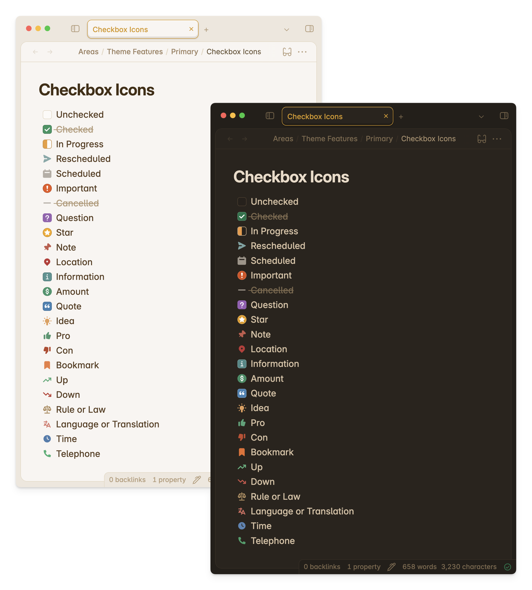

import { Steps } from '@astrojs/starlight/components';

## Checklists

:::note[Is this feature customizable?]
Yes! With the [Style Settings](obsidian://show-plugin?id=obsidian-style-settings) plugin.
:::

<Steps>
1. In your Obsidian vault, open up Settings.
2. Under Community Plugins, click on **Style Settings**. Optionally, if you prefer to customize outside of the Settings modal, you can open up Style Settings through the Command Palette and looking for `Style Settings: Show style settings view`.
3. On the Style Settings tab, navigate to Primary Theme Settings -> Notes and Files -> Checkbox
4. And there you go! Don't forget to read the notes and description. 
</Steps>

Here are the customizable options for checklists:
- background color of unchecked items
- background color of checked items
- check icon color of checked items
- strikethrough/text decoration for checked items
- text color of checked items
- roundness of checkboxes

## Checkbox Icons



Primary also offers checkbox icons out of the box. These are also called *alternative checkboxes*, *checkbox styles*, or *checklist status icons*.

These extend the functionality of checklists from unchecked and checked, to other statuses like in progress, rescheduled, and more.

On top of task statuses, you can also use checkbox icons to add visual cues to certain paragraphs and texts in your notes.

This is a great feature that is still readable at source view. This means that when exporting notes, they can be easily read and interpreted, and its implementation can be easily adapted, modified, or changed even without Obsidian.

The Obsidian community has come around a standard for when themes implement checkbox icons. Primary offers the standard following especially Minimal's and Sanctum's implementation. Although I did remove fire, key, and win. (If you use them often let me know and I'll add them.) 

The feature is inspired by bullet journaling, and originally implemented in [Sanctum](https://github.com/jdanielmourao/obsidian-sanctum) for Obsidian.

### Syntax

Here's the complete syntax for the available checkbox styles you may use! This is on top of the default unchecked and checked styles.

```markdown
- [/] In Progress
- [>] Rescheduled
- [<] Scheduled
- [!] Important
- [-] Cancelled
- [?] Question
- [*] Star
- [n] Note
- [l] Location
- [i] Information
- [S] Amount
- ["] Quote
- [I] Idea
- [p] Pro
- [c] Con
- [b] Bookmark
- [u] Up
- [d] Down
- [r] Rule/Law
- [L] Language/Translation
- [t] Time/Clock
- [T] Telephone
```

### Customization

:::note[Is this feature customizable?]
Yes! With the [Style Settings](obsidian://show-plugin?id=obsidian-style-settings) plugin.
:::

Customization for this feature is available from Primary 2.8.0 and above.

You can customize the colors for each checkbox icon. For some checkboxes, you can customize the text decoration (if the text has a strikethrough or not), and roundness of the checkbox.

Make sure to have Style Settings installed and turned on. Here are the steps to customize them:

<Steps>
1. In your Obsidian vault, open up Settings.
2. Under Community Plugins, click on **Style Settings**. Optionally, if you prefer to customize outside of the Settings modal, you can open up Style Settings through the Command Palette and looking for `Style Settings: Show style settings view`.
3. On the Style Settings tab, navigate to Primary Theme Settings -> Notes and Files -> Checkbox Icons
4. And there you go! Don't forget to read the notes and description. 
</Steps>