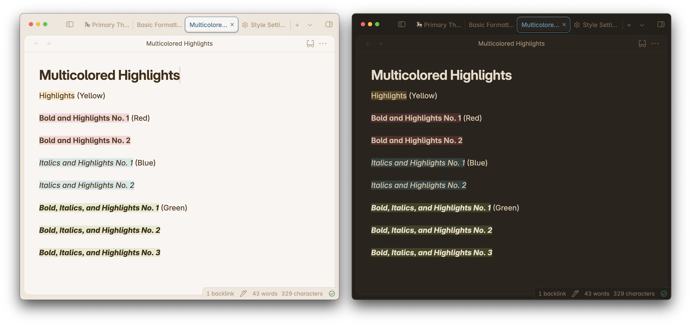

import { Steps } from '@astrojs/starlight/components';



Primary offers Multicolored Highlights out of the box. This can be activated by combining 2 or more markdown syntaxes.

Primary gives you 3 additional highlight colors by using a mix of bold, italics, and highlights. Let's go through all the available highlight colors.

## Highlighting Options

### Highlight Only

A normal highlight like so:
```
==How razorback-jumping frogs can level six piqued gymnasts.==
```

Will give you a yellow highlight color.

### Bold and Highlight

If you mix highlight and bold markdown syntax like so:
```
**==How razorback-jumping frogs can level six piqued gymnasts.==**

```
You will get a red highlight color.

### Italic and Highlight

If you mix highlight and italic markdown syntax like so:
```
*==How razorback-jumping frogs can level six piqued gymnasts.==*

```
You will get a blue highlight color.

### Bold, Italic, and Highlight

If you mix highlight, bold, and italic markdown syntax like so:
```
***==How razorback-jumping frogs can level six piqued gymnasts.==***

```
You will get a green highlight color.

:::caution
In **Live Preview or Source Mode**, Obsidian will render the multicolor highlight properly regardless of the order of the syntaxes.

However, in **Preview Mode**, Obsidian won't render the multicolor highlight properly if not written in the order shown above.
:::

## Customization

:::note[Is this feature customizable?]
Yes! With the [Style Settings](obsidian://show-plugin?id=obsidian-style-settings) plugin.
:::

Customization for this feature is available from Primary 2.7.0 and above. Make sure to have Style Settings installed and turned on. Here are the steps to customize them:

<Steps>
1. In your Obsidian vault, open up Settings.
2. Under Community Plugins, click on **Style Settings**. Optionally, if you prefer to customize outside of the Settings modal, you can open up Style Settings through the Command Palette and looking for `Style Settings: Show style settings view`.
3. On the Style Settings tab, navigate to Primary Theme Settings -> Notes and Files -> Highlight
4. Under Highlight, you'll find the all customization options for all highlights, including highlighted text color.
</Steps>